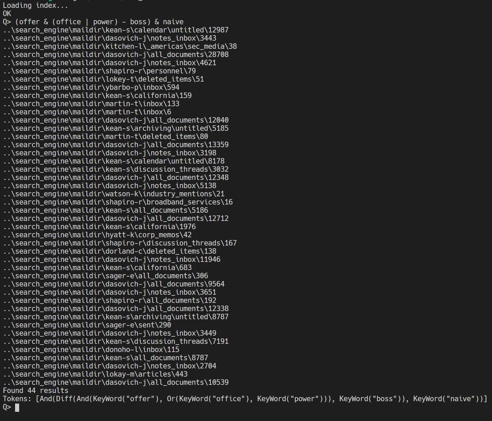
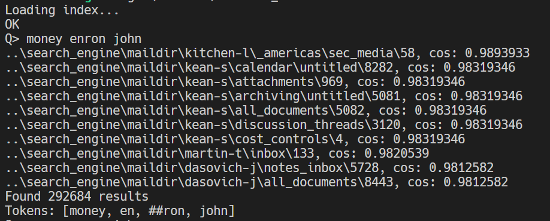

# 实验报告

PB17000163 周天尧
PB17000160 黄梓旭

## 实验目的

本实验要求以给定的邮件数据集为基础，实现一个邮件搜索引擎。对于给定的查询，能够以精确查询或模糊语义匹配的方式返回最相关的一系列邮件文档。

## 实验工具

语言：Rust
数据库：sled
词汇库：BERT
停用词库：Spark
并行库：rayon, crossbeam

## 算法描述

### 建立索引

- 读文件
- 给每个文件赋予唯一id
- 分词，去停用词等处理
- 计算每个词和对应文件的tf值
- 建立倒排索引并计算df值

### 布尔搜索

解析输入语句，建立查询语法树，语法树节点的结构如下

```rust
enum Query {
    KeyWord(String),
    Or(&Query, &Query),
    And(&Query, &Query),
    Diff(&Query, &Query),
}
```

查询时递归执行查询，对于KeyWord类型，默认取关键词包含的token对应的文件集合的交集，对于Or, And, Diff类型分别取子查询结果的并、交和差。

### 语义查询

- 对查询短语分词，取其中所有token对应的文件集合的并集
- 只对查询短语中包含的token计算tfidf，文件的tfidf向量只包含查询短语中的token （* 原因见优化部分）
- 计算文件tdidf向量和查询短语的向量（全部是1）的夹角余弦值
- 排序，取前10个

## 优化

我们先用Python实现了所有功能，实际测试时发现效率很低。经过我们讨论，依次发现几个问题：磁盘对于小文件读取性能差，因为我们在拷贝原始数据集时发现拷贝速度很慢，1G多的文件花了17分钟。于是我们考虑制作ram disk，结果无效，反而更慢，可能是因为ram disk使可用内存变少了，内存压力变大；之后我们怀疑是分词过慢，于是我们将读取和分词作为两个步骤完成，发现分词比读取还快，并注意到Python读取文件速度很慢，仅2MB/S；最后，我们花了一晚上的时间建立索引，在测试查寻性能时发现仅查出一万个结果就花了五分钟，把问题定位在数据库读取上，我们用redis作为后端数据库，读取数据涉及到RPC，Python的redis客户端redis-py的序列化与反序列化是用Python实现的，效率很低。最后决定放弃Python，使用编译型语言，选择了Rust，并放弃redis，选择了内置在程序中的数据库来避免RPC的开销。

使用rust后光读取文件速度就达到了10MB/S。我们在此基础上进一步优化，具体如下：

建立索引步骤：读文件，赋予id，分词，计算tf和df，生成索引采用多线程流水线完成，同时多文件并行分词，CPU占用率由Python的20%提升到接近100%，充分利用机器计算资源，使得整个建立索引步骤由一整晚降低到10分钟，性能提升巨大。

存储时用bincode格式序列化，整数采用变长存储，并对数据库进行压缩，最终生成文件大小为5.38GB，而没有使用变长存储时为10GB。

语义查询步骤：基于以下两个事实：Apache Lucene计算文件tfidf向量时只考虑了查询语句中的term；实际测试时发现考虑所有token和仅考虑查询语句token结果相似度极高。我们只对查询语句中出现的token进行计算。并且并行地计算每个文件向量与查询向量夹角，使得查询时间缩短到10秒内，而未优化的Python版需要几分钟。

存储方式：考虑到tf矩阵大部分元素为0，是稀疏矩阵，按照文件id，token id的二元组作为key，存入kv数据库中，空间复杂度由O(文件数量*token数量)降到O(∑每个文件单词数)

||优化前|优化后|
|-|-|-|
|建立索引时间|一整晚|10分钟|
|索引大小|10GB|5.38GB|
|查询时间|几分钟|<10秒|
|CPU占用率|20%|100%|
|加载数据速度|2MB/S|10MB/S|

## 运行结果

布尔查询



语义查询



## 总结

本次实验使我熟悉了一般搜索引擎的原理以及具体实现方式，同时感受到了优化程序提升性能的乐趣，收获很大！
